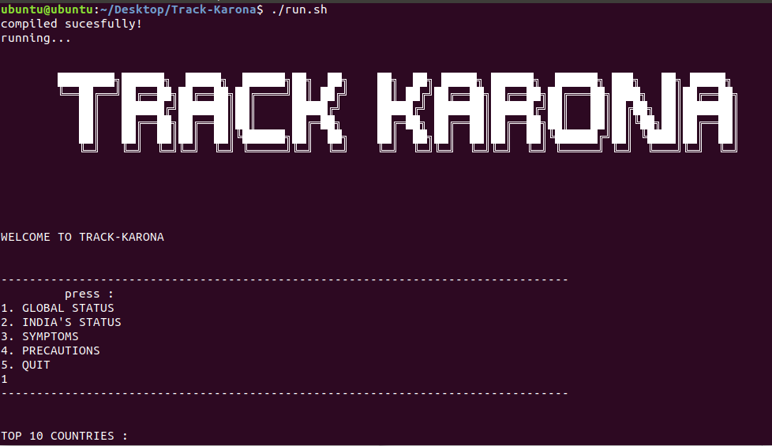
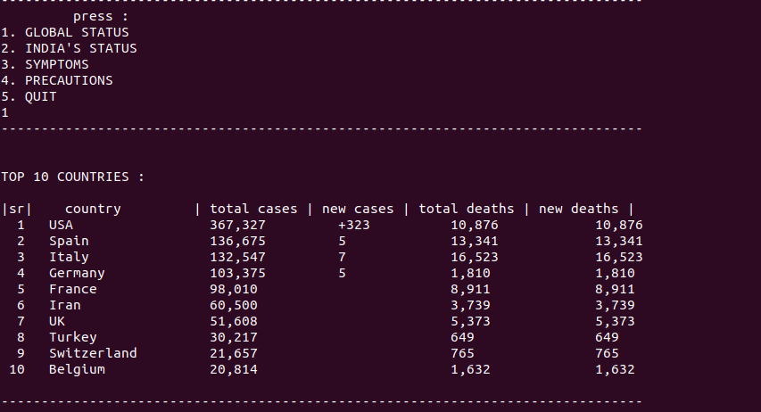

<h1 align="center">
  <br>
  
  <br>
</h1>

<h4 align="center">A Tracker made with c to show Covid-19 updates.</h4>
<p align="center">
    
</p>

<p align="center">
  • <a href="#key-features">Key Features</a> •
  <a href="#how-to-use">How To Use</a>
</p>




## Key Features

* ### Live updates
* ### command line
  - All The updates is available in your conmmand line
* ### Information about virus
    - symptoms
    - Precautions
* ### Offline Mode -
    - it is possible to acess the symptoms and the precautions from the ofline mode
* ### Cross platform
  - Windows, Linux ready.

## How To Use

To clone and run this application, you'll need [Git](https://git-scm.com) installed on your computer. From your command line:

```bash
# Below commands are Tried and Tested on Linux OS

# Clone this repository
$ git clone https://github.com/nis130/Track-Karona

# Go into the repository
$ cd Track-Karona

# Install dependencies
$ sudo bash install.sh

# Run the app
$ chmod +x run.sh
$ ./run.sh
```

## Credits

This Program  uses the data  from following:

- [covid19api](https://covid19api.com/)

### Contributors

- [@nis130](https://github.com/nis130)
- [@alisolanki](https://github.com/alisolanki)
- [@mrpandya](https://github.com/mrpandya)
---
## Aim
This project was part of our `FY PIC (programming in c)` mini project submission.
